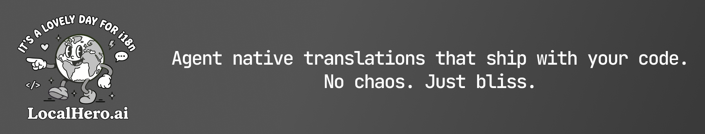

<p align="center">
  
</p>

## How it works

1. **You or your agent writes source strings** → Install the Localhero skill and your AI assistant gets your glossary, style guide, and key naming conventions in context. It writes source strings that match your brand voice.
2. **Localhero translates** → Run the CLI or let the GitHub Action handle it on every push. Only changed keys, nothing extra.
3. **Translations ship in the same PR** → No separate translation PRs,
   no drift, no "we forgot to translate that page."

[Learn more at localhero.ai](https://localhero.ai/)

## Quick start

Sign up at [localhero.ai](https://localhero.ai), then:

```bash
# Set up your project
$ npx @localheroai/cli init
```

```bash
# Install the agent skill (Claude Code, Cursor, Copilot, Codex) using skills.sh or similar
$ npx skills add localheroai/agent-skill
```

The init wizard detects your framework, configures your translation paths, and optionally sets up the GitHub Action.

## Why Localhero.ai

Most translation tools bolt on after the fact. You write code, then
remember to run a translation step, then review, then commit separately.
It's always slightly broken.

Localhero.ai treats translations as part of your development flow:

- Your agent knows your glossary and uses it while writing code
- CI translates only changed keys per PR, your feature branches stay focused
- Translations commit alongside your code, not after it
- Works with the i18n files you already have: `JSON`, `YAML`, `.po`
- Auto-detects Rails, Django, React, and generic project structures

### Production grade translations

- Glossary enforcement → your product terms stay consistent across languages
- Translation memory → tweaks and approved translations are reused to learn your project voice
- Style and tone settings → control how your brand sounds in translation
- Quality insights → see what's being translated, catch inconsistencies

## Coding agent skill

Localhero.ai ships an agent skill that works with Claude Code, Cursor,
GitHub Copilot, Codex, and any tool supporting the Agent Skills standard.

```bash
$ npx skills add localheroai/agent-skill
```

When activated, your assistant gets:

- Your project's glossary terms (loaded live from the API)
- Style and tone settings
- Key naming conventions from your existing files

Your source strings stay consistent with your product's voice. Translations happen automatically when you push.

## Works with your stack

We auto-detect your project during init.

- **Rails** - YAML files in config/locales/
- **Django** - .po files via gettext
- **React / Next.js** - JSON translation files
- **Generic** - any JSON or YAML structure

### Multi-language files (beta)

Some projects keep all locales in one file, with top-level locale keys. Common in Rails apps that co-locate i18n with mailer templates or view components:

```yaml
en:
  subject: "You've been invited"
sv:
  subject: "Du har blivit inbjuden"
```

Opt in by adding `multiLanguageFiles: true` to your `localhero.json`:

```json
"translationFiles": {
  "paths": ["config/locales/", "apps/"],
  "pattern": "**/*.{yml,yaml}",
  "multiLanguageFiles": true
}
```

Detection rule: every top-level key in the file must be a configured locale (in `sourceLocale` or `outputLocales`), and there must be at least two. Supported formats: YAML and JSON. PO files are not supported.

This is a beta feature — please report issues.

## Ignoring keys

Some keys shouldn't be translated by LocalHero — for example, Rails validation
errors served in English by an API, or internal admin strings. Add them to
`translationFiles.ignoreKeys` in your `localhero.json`:

```json
{
  "translationFiles": {
    "ignoreKeys": [
      "activerecord.errors.*",
      "admin.internal.*"
    ]
  }
}
```

Matching keys are skipped during `push` and `translate`. Two pattern forms are
supported: exact names (`foo.bar.baz`) and trailing wildcards (`foo.bar.*`,
recursive). Use `--verbose` to see a summary of what was ignored.

Not yet supported for `.po` / `.pot` files — those are uploaded unfiltered with
a warning.

## Commands

### Initialize a Project

```bash
npx @localheroai/cli init
```

The init command helps you set up your project with LocalHero.ai. It will:
- Setup your API key if it hasn't been done already
- Detect your project type (Rails, React, or generic)
- Link to an existing LocalHero.ai project
- Configure translation paths and file patterns
- Set up GitHub Actions (optional)
- Import existing translations (optional)

This creates a `localhero.json` configuration file in your project root that stores your project settings:
- Project identifier
- Source and target languages for translation
- Translation file paths and patterns
- Ignore patterns for files to exclude

The configuration file is used by the tool to interact with your translations and the API.

### Login

```bash
npx @localheroai/cli login
npx @localheroai/cli login --api-key tk_xxx  # Non-interactive
```

Authenticate with the API using your API key. Saves to `.localhero_key` and adds it to .gitignore.

### Glossary & Settings

```bash
npx @localheroai/cli glossary                 # View project glossary terms
npx @localheroai/cli glossary --search work   # Search glossary
npx @localheroai/cli settings                 # View project translation settings
```

Both support `--output json` for machine-readable output.

### Translate

```bash
npx @localheroai/cli translate
```

Translating your missing keys:
- Automatically detects missing translations and sends them to the Localhero.ai translation API for translation
- Updates translation files with any new or update translations
- It's run manually or by GitHub Actions. When run as a GitHub action any new translations are automatically committed to git.

#### Options

**`--verbose`**: Enable verbose logging for the translation process.

**`--changed-only`**: Only translate keys that have changed in the current branch _[experimental]_

```bash
npx @localheroai/cli translate --changed-only
```

The command uses git to identify which keys have been added or modified in your translation files by comparing to your base branch. It then only translates those specific keys, not like the default, which finds all missing translations and translates them.

You can customize the base branch in your `localhero.json`:

```json
{
  "translationFiles": {
    "paths": ["locales/"],
    "baseBranch": "develop"
  }
}
```

### CI

```bash
npx @localheroai/cli ci
```

A specialized command for running in CI/CD environments (GitHub Actions etc.). This command automatically detects the operation mode and context:

#### Mode Detection

**Sync Mode** (when `syncTriggerId` is present in `localhero.json`):
- Fetches translations from LocalHero.ai export API
- Updates local translation files with new/modified translations
- Removes `syncTriggerId` after successful sync

**Translate Mode** (default):
- **On feature branches**: Only translates changed keys (using `--changed-only` mode)
- **On main/master**: Translates all missing keys

Both modes automatically commit changes to your repository when running in GitHub Actions.

#### Options

**`--verbose`**: Show detailed progress, mode detection, and context information.

```bash
npx @localheroai/cli ci --verbose
```

### Pull / push

```bash
npx @localheroai/cli pull
```

Pull the latest translation updates from LocalHero.ai to your local files. This command will download any new or modified translations from the service to your local files.

#### Options

**`--changed-only`**: Only pull translations for keys that changed in the current branch _[experimental]_

```bash
npx @localheroai/cli pull --changed-only
```

Uses git to identify which keys changed in your branch, then only applies translations for those specific keys. Useful for feature branches to avoid pulling unrelated translation updates and keep PRs focused.

```bash
npx @localheroai/cli push
```

Push updates from your local translation files to LocalHero.ai. This command will upload any new or modified translations from your local files to the service.

### Clone

```bash
npx @localheroai/cli clone
```

Download all translation files from LocalHero.ai to your local project directory. This command is useful when your translation files aren't checked into version control. For example when:

- Setting up a new workspace
- Fetching latest translation files during deploy

## Environment Variables

Typically you don't need to set these. The cli will use `LOCALHERO_API_KEY` if it's set, otherwise it will check the file `.localhero_key` for a API key.

Configure the CLI behavior with these environment variables:

| Variable | Description | Default |
|----------|-------------|---------|
| `LOCALHERO_API_KEY` | Your LocalHero API key (get it at [localhero.ai/api-keys](https://localhero.ai/api-keys)) | Required |
| `LOCALHERO_API_HOST` | API host for LocalHero (you typically don't need to change this) | https://api.localhero.ai |

## GitHub Actions Integration

LocalHero.ai automatically translate your I18n files when you push changes. During the `init` command, you'll be prompted to set up GitHub Actions.

1. Add your API key to your repository secrets:
   - Go to Settings > Secrets and variables > Actions
   - Create a new secret named `LOCALHERO_API_KEY`
   - Add your API key as the value

2. The workflow will:
   - Run on push to pull requests
   - Check for missing translations and add new/updated translations to the repo.

🚧 **Skip translations on a PR**: Add the `skip-translation` label to any PR to skip the translation workflow. Useful when you're still working on copy changes.


## Support

- Documentation: [localhero.ai/docs](https://localhero.ai/docs)
- Email: hi@localhero.ai

## License

MIT License - see LICENSE file for details
