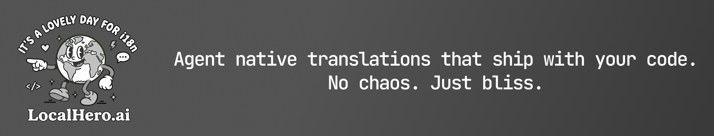

<p align="center">
  
</p>

## How it works

1. **You or your agent writes source strings** → Install the Localhero skill and your AI assistant gets your glossary, style guide, and key naming conventions in context. It writes source strings that match your brand voice.
2. **Localhero translates** → Run the CLI or let the GitHub Action handle it on every push. Only changed keys, nothing extra.
3. **Translations ship in the same PR** → No separate translation PRs,
   no drift, no "we forgot to translate that page."

[Learn more at localhero.ai](https://localhero.ai/)

## Quick start

Sign up at [localhero.ai](https://localhero.ai), then:

```bash
# Set up your project
$ npx @localheroai/cli init
```

```bash
# Install the agent skill (Claude Code, Cursor, Copilot, Codex) using skills.sh or similar
$ npx skills add localheroai/agent-skill
```

The init wizard detects your framework, configures your translation paths, and optionally sets up the GitHub Action. The [project setup guide](https://localhero.ai/docs/setup) walks through each step, including how locale codes are matched to your filenames.

## Why Localhero.ai

Most translation tools bolt on after the fact. You write code, then
remember to run a translation step, then review, then commit separately.
It's always slightly broken.

Localhero.ai treats translations as part of your development flow:

- Your agent knows your glossary and uses it while writing code
- CI translates only changed keys per PR, your feature branches stay focused
- Translations commit alongside your code, not after it
- Works with the i18n files you already have: `JSON`, `YAML`, `.po`
- Auto-detects Rails, Django, React, and generic project structures

### Production grade translations

- Glossary enforcement → your product terms stay consistent across languages
- Translation memory → tweaks and approved translations are reused to learn your project voice
- Style and tone settings → control how your brand sounds in translation
- Quality insights → see what's being translated, catch inconsistencies

## Coding agent skill

Localhero.ai ships an agent skill that works with Claude Code, Cursor,
GitHub Copilot, Codex, and any tool supporting the Agent Skills standard.

```bash
$ npx skills add localheroai/agent-skill
```

When activated, your assistant gets:

- Your project's glossary terms (loaded live from the API)
- Style and tone settings
- Key naming conventions from your existing files

Your source strings stay consistent with your product's voice. Translations happen automatically when you push.

## Works with your stack

We auto-detect your project during init.

- **Rails** - YAML files in config/locales/
- **Django** - .po files via gettext
- **React / Next.js** - JSON translation files
- **Generic** - any JSON or YAML structure

### Multi-language files (beta)

Some projects keep all locales in one file, with top-level locale keys:

```yaml
en:
  subject: "You've been invited"
sv:
  subject: "Du har blivit inbjuden"
```

Opt in by setting `translationFiles.multiLanguageFiles: true`. YAML and JSON only, not PO. A file is treated as multi-language when every top-level key is a configured locale (source or output), with at least two locales present.

## Ignoring keys

Skip keys you don't want translated (e.g. Rails validation errors, internal admin strings) via `translationFiles.ignoreKeys`:

```json
{
  "translationFiles": {
    "ignoreKeys": ["activerecord.errors.*", "admin.internal.*"]
  }
}
```

Patterns are exact names or trailing wildcards (`foo.*`, recursive). Matches are skipped during `push` and `translate`; use `--verbose` for a summary. Not supported for `.po` / `.pot` files.

## Commands

Every command and flag is documented in the [CLI reference](https://localhero.ai/docs/cli-reference).

### Initialize a Project

```bash
npx @localheroai/cli init
```

The init command helps you set up your project with LocalHero.ai. It will:
- Setup your API key if it hasn't been done already
- Detect your project type (Rails, React, or generic)
- Link to an existing LocalHero.ai project
- Configure translation paths and file patterns
- Set up GitHub Actions (optional)
- Import existing translations (optional)

This creates a `localhero.json` configuration file in your project root that stores your project settings:
- Project identifier
- Source and target languages for translation
- Translation file paths and patterns
- Ignore patterns for files to exclude

The configuration file is used by the tool to interact with your translations and the API.

### Login

```bash
npx @localheroai/cli login
npx @localheroai/cli login --api-key tk_xxx  # Non-interactive
```

Authenticate with the API using your API key. Saves to `.localhero_key` and adds it to .gitignore.

### Glossary & Settings

```bash
npx @localheroai/cli glossary                 # View project glossary terms
npx @localheroai/cli glossary --search work   # Search glossary
npx @localheroai/cli settings                 # View project translation settings
```

Both support `--output json` for machine-readable output.

### Translate

```bash
npx @localheroai/cli translate
```

Translating your missing keys:
- Automatically detects missing translations and sends them to the Localhero.ai translation API for translation
- Updates translation files with any new or update translations
- It's run manually or by GitHub Actions. When run as a GitHub action any new translations are automatically committed to git.

#### Options

**`--verbose`**: Enable verbose logging for the translation process.

**`--changed-only`**: Only translate keys that have changed in the current branch _[experimental]_

```bash
npx @localheroai/cli translate --changed-only
```

The command uses git to identify which keys have been added or modified in your translation files by comparing to your base branch. It then only translates those specific keys, not like the default, which finds all missing translations and translates them.

You can customize the base branch in your `localhero.json`:

```json
{
  "translationFiles": {
    "paths": ["locales/"],
    "baseBranch": "develop"
  }
}
```

### CI

```bash
npx @localheroai/cli ci
```

A specialized command for running in CI/CD environments (GitHub Actions etc.). This command automatically detects the operation mode and context:

#### Mode Detection

**Sync Mode** (when `syncTriggerId` is present in `localhero.json`):
- Fetches translations from LocalHero.ai export API
- Updates local translation files with new/modified translations
- Removes `syncTriggerId` after successful sync

**Translate Mode** (default):
- **On feature branches**: Only translates changed keys (using `--changed-only` mode)
- **On main/master**: Translates all missing keys

Both modes automatically commit changes to your repository when running in GitHub Actions.

#### Options

**`--verbose`**: Show detailed progress, mode detection, and context information.

```bash
npx @localheroai/cli ci --verbose
```

### Check

```bash
npx @localheroai/cli check
```

Checks your translation files for missing keys, broken placeholders and structure problems. It runs offline on the files in your repo, with no Localhero.ai account, no API key and no `localhero.json` needed. Run it once to see where a repo stands, or in CI to fail a pull request that leaves translations behind.

With a `localhero.json` it uses that file's paths, locales and `ignoreKeys`. Without one it finds the locale folder the way `init` does and reads the languages from file and folder names. The source language is the first of: `--source`, a gettext catalog whose `msgstr` are untranslated, a `.pot` template, `en` and the language with the most keys. `check` prints what it picked and says so when it guessed. A language only counts as a target when one of its files matches a source file. That leaves out vendored translations such as rails-i18n.

For each target locale it reports:

- **Missing keys**: in the source but absent or `null` in the target. Without a config, a source file the language has no file for is listed as not checked instead of counting all its keys as missing.
- **Placeholder mismatches**: a placeholder the translation drops or adds. Covers Rails `%{name}` and `%<name>s`, printf (`%s`, `%d`, positional `%1$s`), i18next `{{name}}`, ICU `{name}` and Python `%(name)s`. Translators may reorder positional arguments. Date formats (`%b %d`) and literal percent signs are not compared.
- **Placeholder hints**: a `zero`, `one` or `two` form that leaves out a placeholder, like `"%{count} language"` → `"1 språk"`. That is often correct. Hints never fail the run. A `few`, `many` or `other` form that drops a placeholder is a mismatch.
- **Missing plural categories**: a Rails plural group without the forms its language needs, like Polish with only `one` and `other`. Rails falls back to `other` without raising an error.
- **Structure mismatches**: a string in the source that is a map or array in the target, or a plural group collapsed to one string.
- **Conflicting and duplicate keys**: a key defined with different values in several YAML files of one locale, or twice in the same file. Rails keeps one of the values and says nothing. Gettext domains, i18next namespaces and multi-language files are separate namespaces and are not compared with each other.
- **Orphan keys**: in a target but in no source file. They are warnings only. Often they are framework translations the source never had.
- **Empty and identical values**: an empty target string fails like a missing key. A target identical to its source is a hint, as short words and names are often the same across languages.

#### Options

**`--source <locale>`**: The source language. Defaults to the one in `localhero.json`, or the detected one without it.

**`--locales <codes>`**: Comma-separated target locales to check. Defaults to the configured output locales, or every matching language found without a config.

**`--path <dir>`**: The locale folder to scan when there is no `localhero.json`. Use it for layouts the detection misses.

**`--pattern <glob>`**: The file pattern inside `--path`. Defaults to `**/*.{json,yml,yaml,po,pot}`.

**`--json`**: Prints the full report as JSON on stdout and nothing else: every finding, the files loaded per locale, files that could not be parsed and what was detected without a config. Key names stay stable between releases. `changedOnly` is `null` in a full check. In changed-only mode it is `{ "base": "main (d260ed6)", "diffAvailable": true }` and each finding has `"introduced": true` when the base did not have it, `false` when it was already there. When the comparison failed it is `{ "base": null, "diffAvailable": false, "reason": "..." }` and findings have no `introduced`.

**`--all`**: Prints every finding instead of the first 10 per category.

**`--fail-on <mode>`**: When to exit 1. `missing` fails on missing or empty keys. `placeholders` fails on placeholder mismatches. `any` fails on every finding except hints, orphan keys and files not checked. `none` never fails. A file that cannot be parsed fails every mode except `none`. The default is `missing` for a full check. When `check` compares with the base branch, only new problems count and the default is `any`: every new problem fails the pull request.

**`--format <github|text>`**: `github` prints GitHub Actions annotations instead of the report: `::error` for problems, `::warning` for orphan and duplicate keys, `::notice` for hints. At most 50, followed by a count of the rest. Annotations point at files, not lines. In GitHub Actions `github` is the default; `--format text` prints the report there instead. `--json` wins over both.

**`--changed-only`**: Only reports and fails on new problems: ones the base branch did not have. `check` runs the same checks on the base versions of the files to tell. A problem that was already there is counted, not listed. It never fails the run, even when the branch edited its key. One that changed, like a placeholder mismatch that now misses a different placeholder, counts as new. The base is `translationFiles.baseBranch` from `localhero.json`, else `main` or `master`. On a GitHub pull request it is the pull request's base branch. There this mode is on by default.

**`--full`**: Checks every key, also on a pull request.

In CI, pass `--source` so the gate never depends on a guess:

```bash
npx @localheroai/cli check --source en
npx @localheroai/cli check --source en --locales sv,de --fail-on any
npx @localheroai/cli check --json > report.json
```

#### In GitHub Actions

```yaml
- uses: actions/checkout@v7
- run: npx @localheroai/cli check --source en
```

That is the whole setup. In GitHub Actions `check` prints annotations. On a pull request it compares with the base branch and fails only on problems the pull request introduced. Those become annotations on the pull request. `check` fetches the base commit itself, which lets the default shallow checkout work. Problems that were already there never fail the run. They go to the job summary, counted per locale and category, next to the pull request's own problems.

If the comparison fails, for example when the base commit cannot be fetched, `check` says so in the log and the summary. It then checks every key without failing on what it finds. Parse errors still fail. Checking out with `fetch-depth: 0` avoids this.

Other CI systems get the text report. Pass `--changed-only` there for the same gate.

### Pull / push

```bash
npx @localheroai/cli pull
```

Pull the latest translation updates from LocalHero.ai to your local files. This command will download any new or modified translations from the service to your local files.

#### Options

**`--changed-only`**: Only pull translations for keys that changed in the current branch _[experimental]_

```bash
npx @localheroai/cli pull --changed-only
```

Uses git to identify which keys changed in your branch, then only applies translations for those specific keys. Useful for feature branches to avoid pulling unrelated translation updates and keep PRs focused.

```bash
npx @localheroai/cli push
```

Push updates from your local translation files to LocalHero.ai. This command will upload any new or modified translations from your local files to the service.

### Clone

```bash
npx @localheroai/cli clone
```

Download all translation files from LocalHero.ai to your local project directory. This command is useful when your translation files aren't checked into version control. For example when:

- Setting up a new workspace
- Fetching latest translation files during deploy

## Environment Variables

Typically you don't need to set these. The cli will use `LOCALHERO_API_KEY` if it's set, otherwise it will check the file `.localhero_key` for a API key.

Configure the CLI behavior with these environment variables:

| Variable | Description | Default |
|----------|-------------|---------|
| `LOCALHERO_API_KEY` | Your LocalHero API key (get it at [localhero.ai/api-keys](https://localhero.ai/api-keys)) | Required |
| `LOCALHERO_API_HOST` | API host for LocalHero (you typically don't need to change this) | https://api.localhero.ai |

## GitHub Actions Integration

LocalHero.ai automatically translate your I18n files when you push changes. During the `init` command, you'll be prompted to set up GitHub Actions. The [GitHub Actions guide](https://localhero.ai/docs/github-actions) covers the workflow inputs, required permissions, and what the Action skips.

1. Add your API key to your repository secrets:
   - Go to Settings > Secrets and variables > Actions
   - Create a new secret named `LOCALHERO_API_KEY`
   - Add your API key as the value

2. The workflow will:
   - Run on push to pull requests
   - Check for missing translations and add new/updated translations to the repo.

🚧 **Skip translations on a PR**: Add the `skip-translation` label to any PR to skip the translation workflow. Useful when you're still working on copy changes.

### Signed commits

For repos that require verified signed commits, set `"github": { "signedCommits": true }` in `localhero.json`. The CLI then commits via the GitHub App's GraphQL API, which auto-signs the commit.


## Support

- Documentation: [localhero.ai/docs](https://localhero.ai/docs)
- Email: hi@localhero.ai

## License

MIT License - see LICENSE file for details
